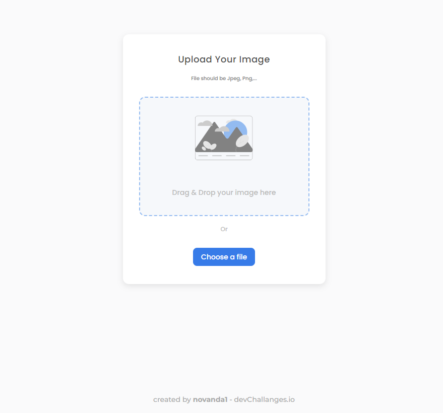

<!-- Please update value in the {}  -->

<h1 align="center">Image Uploader</h1>

<div align="center">
   Solution for a challenge from  <a href="http://devchallenges.io" target="_blank">Devchallenges.io</a>.
</div>

<div align="center">
  <h3>
    <a href="https://image-uploader-web-yvrf.vercel.app/">
      Demo
    </a>
    <span> | </span>
    <a href="https://devchallenges.io/solutions/KQEH8NoQxHBnZzG1WKjW">
      Solution
    </a>
    <span> | </span>
    <a href="https://devchallenges.io/challenges/O2iGT9yBd6xZBrOcVirx">
      Challenge
    </a>
  </h3>
</div>

<!-- TABLE OF CONTENTS -->

## Table of Contents

- [Overview](#overview)
  - [Built With](#built-with)
- [Features](#features)
- [How to use](#how-to-use)
- [Contact](#contact)
- [Acknowledgements](#acknowledgements)

<!-- OVERVIEW -->

## Overview



### Built With

<!-- This section should list any major frameworks that you built your project using. Here are a few examples.-->

- [Chi](https://go-chi.io/)
- [Vite](https://vitejs.dev/)
- [React](https://reactjs.org/)
- [Golang](https://go.dev/)
- [ImageKit](https://imagekit.io/)
- [Tailwind](https://tailwindcss.com/)
- [React Router 6](https://reactrouter.com/en/v6.3.0)

## Features

<!-- List the features of your application or follow the template. Don't share the figma file here :) -->

This application/site was created as a submission to a [DevChallenges](https://devchallenges.io/challenges) challenge. The [challenge](https://devchallenges.io/challenges/O2iGT9yBd6xZBrOcVirx) was to build an application to complete the given user stories.

## How To Use

<!-- Example: -->

To clone and run this application, you'll need [Git](https://git-scm.com), [Golang](https://go.dev/doc/install) to run the backend, and [NPM/Yarn](https://classic.yarnpkg.com/lang/en/docs/install/#windows-stable) to run the frontend.


```bash
# Change directory to your GOPATH src
$ cd $(go env GOPATH)/src

# Clone this repository
$ git clone git@github.com:novanda1/image-uploader.git

# Create .env file
# change the ImageKit-related config
$ cp env.example .env 

# Run the backend
$ go run main.go

# Run the frontend
$ cd web
$ cp cp example.env .env 
$ yarn install 
$ yarn dev 
```

## Acknowledgements

<!-- This section should list any articles or add-ons/plugins that helps you to complete the project. This is optional but it will help you in the future. For example -->

- [Get Started | Golang Chi](https://go-chi.io/#/pages/getting_started)
- [Get Started | Vite](https://vitejs.dev/guide/#scaffolding-your-first-vite-project)
- [Server side file upload | ImageKit](https://docs.imagekit.io/api-reference/upload-file-api/server-side-file-upload)

## Contact

- GitHub [@novanda1](https://novanda1)
